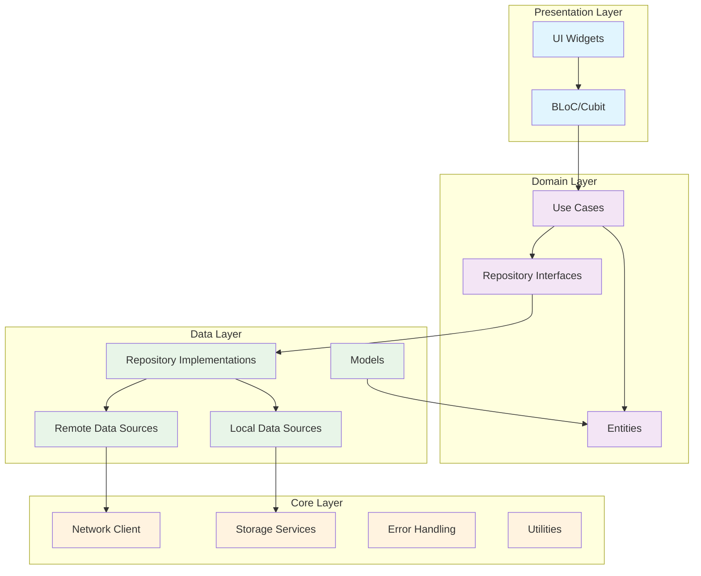

# Mini Feed App

A Flutter application implementing a social media feed with authentication, post management, and offline capabilities using Clean Architecture principles.

## Setup Steps

### Prerequisites
- Flutter SDK (3.8.1 or higher)
- Dart SDK
- Android Studio / VS Code with Flutter extensions
- Git

### Installation

1. **Clone the repository**
   ```bash
   git clone <repository-url>
   cd mini_feed
   ```

2. **Install dependencies**
   ```bash
   flutter pub get
   ```

3. **Generate code (Hive adapters)**
   ```bash
   flutter packages pub run build_runner build
   ```

4. **Run the app**
   ```bash
   flutter run
   ```

### Testing

Run all tests:
```bash
flutter test
```

Run specific test suites:
```bash
# Unit tests only
flutter test test/

# Integration tests (if available)
flutter test integration_test/
```

## Architecture Overview

This app follows **Clean Architecture** principles with clear separation of concerns:

### Layer Structure
- **Presentation Layer**: UI components, state management (BLoC), and user interactions
- **Domain Layer**: Business logic, entities, use cases, and repository interfaces
- **Data Layer**: Data sources (remote/local), models, and repository implementations
- **Core Layer**: Shared utilities, constants, error handling, and infrastructure

### Key Components
- **Entities**: Core business objects (User, Post, Comment)
- **Use Cases**: Business logic operations (Login, GetPosts, ToggleFavorite)
- **Repositories**: Data access abstraction layer
- **Data Sources**: Remote (API) and Local (Hive/SharedPreferences) data handling
- **Models**: Data transfer objects with JSON serialization
- **BLoC**: State management for UI components

### Architecture Diagram



### Data Flow
1. **UI** triggers actions through **BLoC**
2. **BLoC** calls appropriate **Use Cases**
3. **Use Cases** interact with **Repository** interfaces
4. **Repositories** coordinate between **Remote** and **Local** data sources
5. **Data Sources** handle API calls and local storage operations
6. Results flow back through the layers to update the UI

## Decisions & Trade-offs

### Architecture Decisions

**✅ Clean Architecture**
- **Decision**: Implemented Clean Architecture with clear layer separation
- **Rationale**: Ensures maintainability, testability, and scalability
- **Trade-off**: More initial complexity but better long-term maintainability

**✅ BLoC Pattern for State Management**
- **Decision**: Used BLoC/Cubit for state management
- **Rationale**: Predictable state management with clear separation of business logic
- **Trade-off**: Learning curve but better testability and maintainability

**✅ Repository Pattern**
- **Decision**: Implemented Repository pattern with interface abstraction
- **Rationale**: Decouples data sources from business logic, enables easy testing
- **Trade-off**: Additional abstraction layer but improved flexibility

### Technology Choices

**✅ Hive for Local Storage**
- **Decision**: Used Hive for caching and offline storage
- **Rationale**: Fast, lightweight, and type-safe local database
- **Trade-off**: Additional setup complexity but better performance than SQLite

**✅ Dio for HTTP Client**
- **Decision**: Used Dio for network requests
- **Rationale**: Rich feature set with interceptors, error handling, and logging
- **Trade-off**: Larger bundle size but better developer experience

**✅ Dartz for Functional Programming**
- **Decision**: Used Either<Failure, Success> pattern for error handling
- **Rationale**: Explicit error handling and functional programming benefits
- **Trade-off**: Learning curve but more robust error handling

### API Integration

**✅ JSONPlaceholder + reqres.in**
- **Decision**: Used JSONPlaceholder for posts/comments, reqres.in for auth
- **Rationale**: Free, reliable APIs for development and testing
- **Trade-off**: Limited functionality but sufficient for demo purposes

**✅ Mock Authentication**
- **Decision**: Implemented mock authentication system
- **Rationale**: Demonstrates auth flow without complex backend setup
- **Trade-off**: Not production-ready but good for prototyping

### Testing Strategy

**✅ Comprehensive Unit Testing**
- **Decision**: Extensive unit test coverage for all layers
- **Rationale**: Ensures code quality and prevents regressions
- **Trade-off**: Time investment but improved reliability

**✅ Mocking Strategy**
- **Decision**: Used mocktail for dependency mocking
- **Rationale**: Clean, type-safe mocking with null safety support
- **Trade-off**: Additional test setup but better test isolation

## Known Limitations

### Current Implementation Status

**⚠️ Incomplete Features**
- Repository implementations not fully completed
- UI/Presentation layer not implemented
- Integration between layers needs completion
- Some data source method signatures need alignment with storage interfaces

**⚠️ Authentication Limitations**
- Mock authentication system (not production-ready)
- Limited user management features
- No password reset functionality
- No social login integration

**⚠️ Offline Capabilities**
- Basic caching implemented but not fully integrated
- No conflict resolution for offline/online sync
- Limited offline functionality testing

**⚠️ Performance Considerations**
- No image caching implementation
- Limited pagination optimization
- No background sync implementation

### Technical Debt

**🔧 Method Signature Alignment**
- Some data source implementations use method names that don't match the storage service interfaces
- Need to align `storeAccessToken`/`getAccessToken` with `storeToken`/`getToken`
- Storage service methods need to be updated to match expected interface

**🔧 Error Handling**
- Some error scenarios not fully covered
- Need more specific error types for different failure cases
- Error recovery mechanisms could be improved

**🔧 Testing Gaps**
- Integration tests not implemented
- Widget tests not created
- End-to-end testing scenarios missing

### Future Improvements

**🚀 Planned Enhancements**
- Complete repository and presentation layer implementation
- Add comprehensive integration tests
- Implement proper offline sync with conflict resolution
- Add image caching and optimization
- Implement push notifications
- Add social features (likes, shares, follows)
- Improve accessibility support
- Add internationalization (i18n)

**🚀 Performance Optimizations**
- Implement lazy loading for large lists
- Add image compression and caching
- Optimize database queries
- Implement background sync
- Add memory management improvements

## Project Structure

```
lib/
├── core/                   # Shared utilities and infrastructure
│   ├── constants/         # App constants and configuration
│   ├── errors/           # Error handling and exceptions
│   ├── network/          # HTTP client and network utilities
│   ├── storage/          # Local storage services
│   └── utils/            # Utility functions and helpers
├── data/                  # Data layer implementation
│   ├── datasources/      # Remote and local data sources
│   ├── models/           # Data models with JSON serialization
│   └── repositories/     # Repository implementations
├── domain/               # Business logic layer
│   ├── entities/         # Core business objects
│   ├── repositories/     # Repository interfaces
│   └── usecases/         # Business logic operations
├── presentation/         # UI and state management
│   ├── bloc/            # BLoC state management
│   ├── pages/           # Screen widgets
│   └── widgets/         # Reusable UI components
└── main.dart            # App entry point
```

## Contributing

1. Follow the established architecture patterns
2. Write unit tests for new features
3. Use the existing error handling patterns
4. Follow Dart/Flutter style guidelines
5. Update documentation for significant changes

## License

This project is for demonstration purposes.